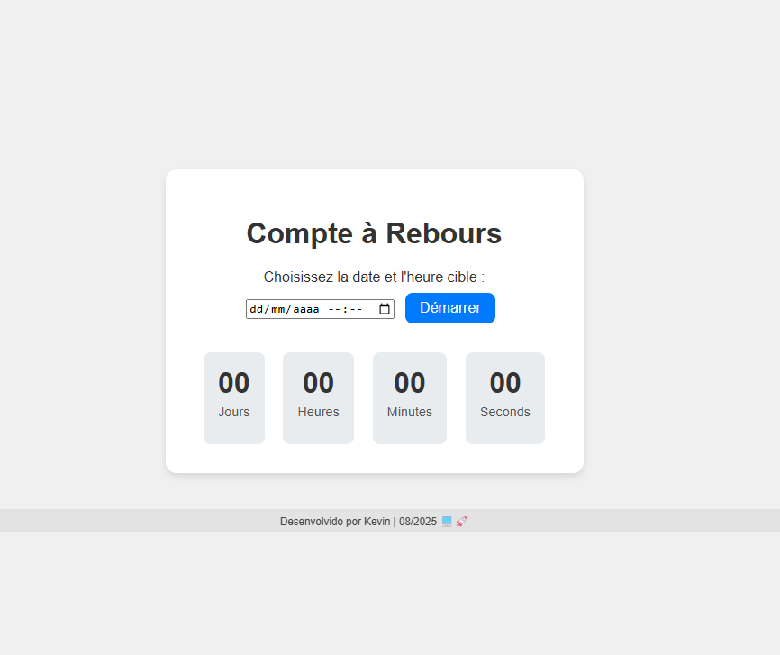

# 🕒 #CompteÀRebours #JavaScript #PetitProjet

Un compteur regressif simple en JavaScript qui permet de définir une date cible et d'afficher le temps restant.



## 🚀 #Fonctionnalités

- 🗓️ Saisie libre de la date cible via un champ `datetime-local`
- ▶️ Bouton de démarrage du compte à rebours
- ⏱️ Mise à jour en temps réel (jours, heures, minutes, secondes)
- 🎉 Affichage d'un message lorsque le temps est écoulé
- ✅ Validation basique de la date saisie

## 🛠️ #TechStack

```bash
# Langages & Outils
HTML5 | CSS3 | JavaScript (Vanilla)

## 🚀 Comment utiliser

1. Ouvrir `index.html` dans un navigateur web
2. Entrer une date/heure cible dans le champ prévu
3. Cliquer sur **Démarrer** pour lancer le compte à rebours
4. Observer le décompte en temps réel
5. Une notification apparaît à la fin du décompte

## 🔮 Améliorations possibles

- 💾 Sauvegarde de la date cible dans `localStorage`
- 🎬 Animations pendant le décompte
- 🔔 Notifications système plus avancées
- ➕ Gestion de plusieurs compteurs simultanés
- 🌐 Mode sombre/clair

## 📁 Structure des fichiers

compte-a-rebours/
.
├── #UI
│   ├── index.html
│   └── style.css
└── #Logic
    └── script.js

#PourquoiCeProjet?

"J'ai créé ce compteur pour pratiquer JavaScript et gérer les dates. C'est open-source alors n'hésitez pas à l'améliorer!"

```

<p align="center">
  💻🚀 <em>Développé par Kevin - Août 2025</em> 💻🚀
</p>
